# 14-Day Velocity Pilot Delivery Framework
**Syna Systems | Operational AI Infrastructure**

This framework governs the rapid scoping, integration, verification, and handover of the Syna Post-Denial Resolution Engine (LangGraph template) within client EHR environments (Epic/Cerner/Athenahealth).

---

## 1. Daily Operational Timeline

```mermaid
gantt
    title 14-Day Delivery Sequence
    dateFormat  X
    axisFormat %d
    section Scoping & Setup
    API Diagnostics & Sandbox Provisioning :active, 0, 3
    section Implementation
    Stateful Node Customization           : 3, 7
    Payer Rule Configuration              : 5, 8
    section Audit & QA
    Sanity Gateway & PHI Masking          : 8, 11
    Dry-Run Shadow Testing                : 10, 12
    section Handover
    HITL Interface Live & Staff Handoff    : 12, 14
```

### Day 1–3: API Diagnostics & Sandbox Provisioning
* **Objective:** Establish zero-trust secure communication tunnel and retrieve EHR metadata.
* **Key Actions:**
  * Provision diagnostic pipeline credentials.
  * Audit endpoint schema mapping for EHR claims.
  * Establish mock transaction logs under HIPAA sandbox rules.
* **Deliverables:** API Connection Log Verification Report.

### Day 4–7: Stateful Graph Deployment
* **Objective:** Configure LangGraph nodes for the Post-Denial Resolution Engine.
* **Key Actions:**
  * Configure Payer Policy Retrieval node endpoints.
  * Custom-wire Clinical Evidence Synthesis criteria based on client specialties.
  * Initialize the Appeal Drafting node.
* **Deliverables:** Draft engine operational blueprint in workspace registry.

### Day 8–11: Sanity Gateway Audit & Compliance Check
* **Objective:** Implement data sanitization and verify HIPAA compliance boundaries.
* **Key Actions:**
  * Deploy sanitization gateway filtering out PHI/PII fields.
  * Perform dry-run shadow submissions using historical denials data.
  * Validate HIPAA audit trail logging systems.
* **Deliverables:** PHI Audit Cleanliness Certificate.

### Day 12–14: Human-in-the-Loop (HITL) Handoff
* **Objective:** Go live with supervisor reviewer interface.
* **Key Actions:**
  * Conduct virtual staff walk-throughs of human override interfaces.
  * Calibrate action-steering triggers (Auto-Approve vs. Human Verification).
  * Sign off SLA verification checklist.
* **Deliverables:** Live Production Handover and SLA Guarantee Statement.

---

## 2. Client Prerequisites

| Requirement Type | Description / Specification | Access Standard |
| :--- | :--- | :--- |
| **API Endpoints** | FHIR Claim Response (`/ClaimResponse`) & Claims Read (`/Claim`) | OAuth 2.0 Client Credentials |
| **Payer Portals** | Scraper-level query access to top 3 regional payer portals | Read-only proxy access |
| **Data Sandbox** | Mirror of EHR containing min. 1,000 historical denial transactions | Isolated HIPAA Sandbox |
| **Personnel** | 1 RCM Manager + 1 IT System Administrator | 2 Hours/Week Alignment |

---

## 3. Operational SLA Commitments

* **Appeal Quality:** 100% compliant with CMS appeal guidelines and payer policies.
* **Verification Rate:** Auto-generated appeal drafts generated within < 45 seconds of claim denial retrieval.
* **Uptime Reliability:** 99.9% API endpoint availability for the proxy sanitization gateway.
* **HITL Escalation:** Critical errors or low-confidence clinical syntheses escalate to human queue instantly.
