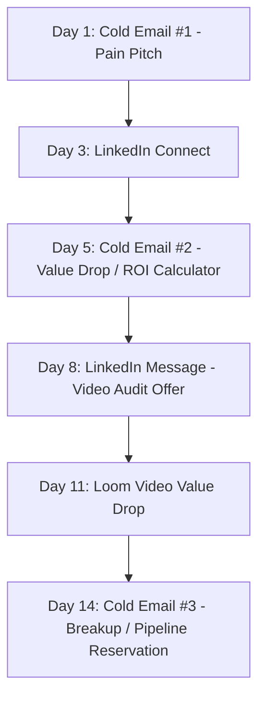

# Healthcare RCM Outreach Playbook
**Syna Systems | Sales & Pipeline Operations**

This playbook outlines target cadences, copy templates, presentation formats, and objection handling protocols for mid-market Revenue Cycle Management (RCM) prospects.

---

## 1. Outreach Cadence & Sequence

* **Target Roles:** Chief Financial Officer (CFO), VP of Revenue Cycle, Director of Patient Financial Services.
* **Target Segments:** Mid-market hospitals, large medical groups ($50M-$500M annual billing).

---

## 2. Copywriting Templates

### Email #1: Pain Pitch (First Touch)
* **Subject:** EHR denial leakage at [Company Name]
* **Body:**
  > [Name],
  > 
  > Mid-market health systems using [EHR System] typically lose 1.5% to 3% of net patient revenue directly to documentation and medical necessity denials.
  > 
  > For a system billing $[Annual Billing]M, that is $[Estimated Leakage] annually in leakages that are completely recoverable.
  > 
  > We built an autonomous post-denial resolution engine specifically for [EHR System] that retrieves denials, matches clinical records against payer rules, and drafts appeals in under 45 seconds—verified by a human before submit.
  > 
  > Are you open to a brief 10-minute diagnostic walkthrough next Tuesday?
  > 
  > Sincerely,
  > [Your Name]
  > Syna Systems

### Email #2: Value Drop (ROI Calculator)
* **Subject:** Recovery simulation for [Company Name]
* **Body:**
  > [Name],
  > 
  > I ran a quick recovery projection for [Company Name] using our RCM leakage calculator. 
  > 
  > Assuming a standard [Denial Rate]% denial rate, your estimated recoverable revenue is $[Estimated Recovery] per year.
  > 
  > I’ve set up a custom calculation page for your team here: [Custom URL]
  > 
  > If you'd like us to run a diagnostic on 50 of your historical denial codes to prove the clean-claim recovery rate, we can configure a sandbox trial in 3 business days. Let me know when is best to sync.
  > 
  > Best,
  > [Your Name]

---

## 3. Presentation Formats (Loom / Video Audit)

* **Duration:** Under 3 minutes.
* **Outline:**
  1. **EHR Interface Visual (0:00 - 0:30):** Show a mock EHR claims workflow. Mention specific API endpoints like `/ClaimResponse`.
  2. **The Denial Loop (0:30 - 1:30):** Show how the LangGraph template queries payer rules, compiles clinical evidence, and prepares appeals without manual work.
  3. **The Guarantee (1:30 - 2:30):** Pitch the 14-day velocity pilot: a working engine deployed to their sandbox in two weeks, or they pay nothing.

---

## 4. Objection Handling Protocols

### Objection 1: "We are worried about HIPAA compliance and PHI exposure."
* **Response:** 
  > "Understood. Our engine integrates via a zero-trust proxy gateway. All patient-identifying data (PHI/PII) is automatically scrubbed and replaced with deterministic tokens before any processing occurs outside your secure network. The final clinical synthesis and appeal drafting happen within your private network."

### Objection 2: "Our EHR APIs are locked down. We can't integrate third-party engines."
* **Response:** 
  > "We don’t require database writes or deep EHR configuration changes. We utilize standard FHIR read APIs (`/ClaimResponse` and `/DiagnosticReport`) which are pre-authorized on modern Epic, Cerner, and Athena installations. Scopes are read-only and restricted to the denial management workflow."

### Objection 3: "AI will hallucinate clinical statements and fail payer audits."
* **Response:** 
  > "We agree—unrestricted AI is a risk in healthcare. That is why our engine uses a deterministic stateful graph: we fetch actual payer policies first, compile clinical metrics verbatim from patient charts, and output drafts directly to a Human-in-the-Loop triage dashboard. Nothing goes to the payer without your coder's physical approval."
